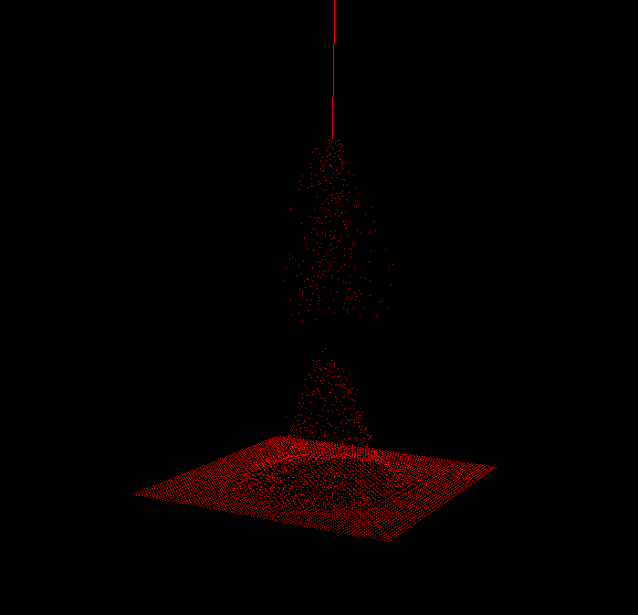

PtFree
====

OpenGL particle simulation using SSBOs (implementation inspired by [Sachsa Willems's implementation](https://github.com/SaschaWillems/openglcpp/)).

Currently each particle just takes a random walk and its position after a certain time is recorded, similar to a Galton box.  Ignore for now.

